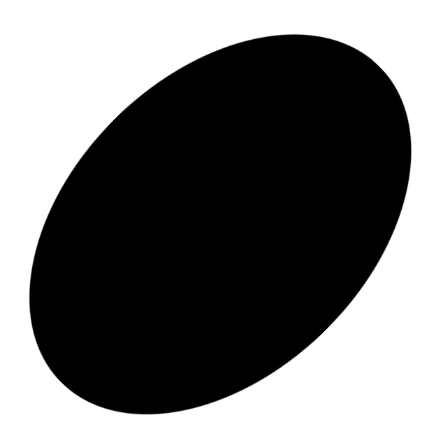
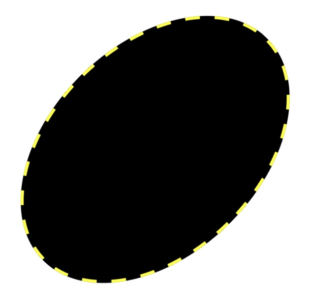
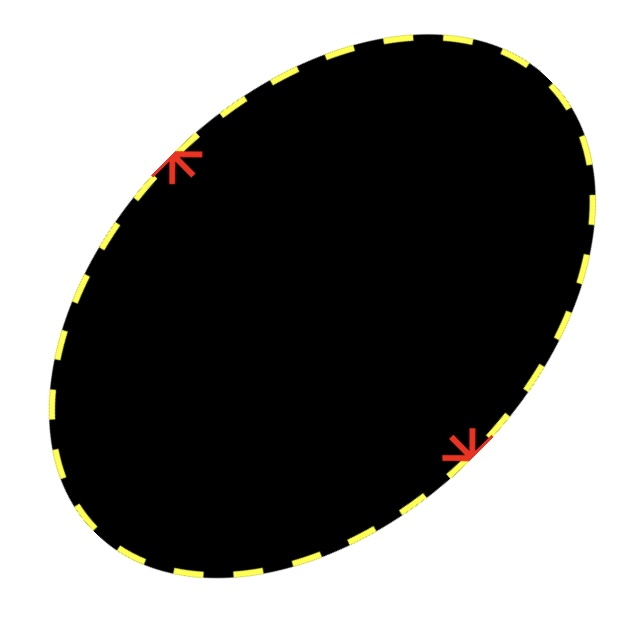
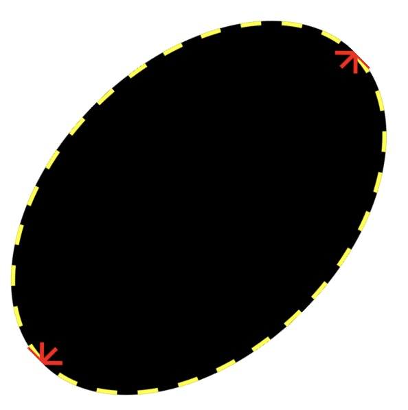
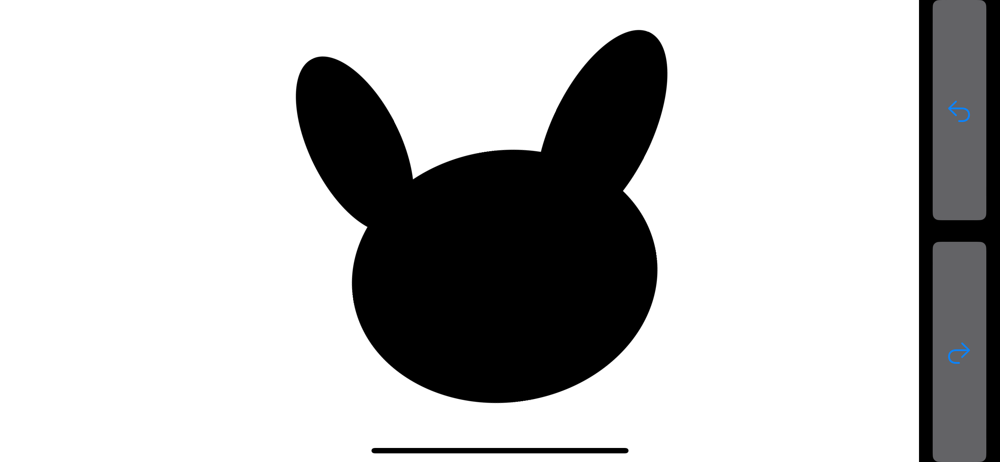
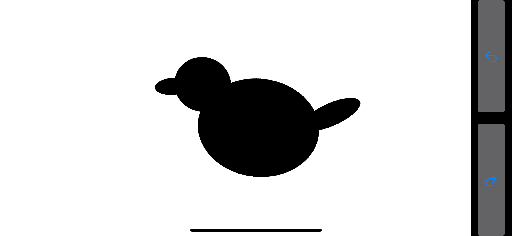

# DrawEllipses: プリミティブベースの形状モデリングインタフェース
ユーザーインターフェイス期末レポート
## 機能
- 楕円の手書きスケッチによる入力
- 指でのドラッグによる楕円の移動
- 指での楕円のサイズの調整（全体のサイズ, 長軸の長さ, 短軸の長さ）
- 指での楕円の回転
- 長押しによる楕円の削除
- Undo/Redo
  
## UIデザイン

### メイン画面
- iPhoneのLandScapeモードで一番右側にUndo/Redoボタンがそれぞれ上下に配置されている
- その左側には描画領域があり、楕円の手書きスケッチによる入力が行われる.

    
### 描画領域
- 手書きスケッチをした後0.4秒程度で手をとめるままにすると, 手書きの軌跡に一番近い楕円が描画される.楕円は同時には一つしか描画されない.

- 描画された楕円は編集モードに入り、指でのドラッグによる移動、サイズの調整、回転が可能である。同一の楕円に対して複数の操作ができないが、複数の楕円をそれぞれ操作することは可能である。下図は左から右、上から下に順番に, 編集モードに入る前の楕円、第1編集モード, 第2編集モード, 第3編集モードの画像である。

- 第１編集モード
    最初に一度タップすると楕円の周りに黄色い点線が現れてドラッグ可能になり、サイズが調整可能になる
    - 複数の楕円を同時に編集モードにすることが可能である.
- 第２編集モード
    もう1回タップすると楕円は長軸長さが調整可能になる.
    - どの軸かを指示するための赤色の矢印が現れる。
    - ここの長軸は必ずしも楕円の長い方の軸とは限らない.
- 第３編集モード
    もう1回タップすると楕円は短軸長さが調整可能になる.
- もう1回タップすると編集モードをオフにすることができる. また, 空白の領域をタップすることでいつでも編集モードをオフにすることができる.
  - 楕円に長押しすると「Delete」ボタンが現れる。
- Undo/Redoは楕円の移動、回転、サイズ変更、削除、追加に対応する.

### 操作動画

https://github.com/user-attachments/assets/4de0d732-f56a-4e66-bdca-c6c3edcb3f71

      
## ユーザーテスト
### ユーザー1　J.T.さん
  - 説明なしでsample0.pngおよびsample1.pngのモデリングに成功
    <figure>
     <figcaption>ユーザー1によるsample0のモデリング</figcaption>
    </figure>
    <figure>
     <figcaption>ユーザー1によるsample1のモデリング</figcaption>
    </figure>
  - 自力で発見できなかった点
    - 長押しによる楕円の削除
    - 2本の指で楕円を回転させること
    - 楕円は長軸と短軸の長さがぞれぞれ調整できること
  - 使いやかった点
    - UIデザインがシンプルで一目瞭然
  - 使いにくかった点
    - ユーザー1にテストしてもらった時点で楕円の位置とサイズの調整はスケッチとは分離されていないため、楕円の中からスケッチしようとすると楕円が移動してしまうことがある。

ユーザー1の意見を受けて, 画面上のすでにある図形の中から描画し始める傾向が見られるので, UIを再デザインした。主な点は
- 楕円の編集モードに入るには一度その楕円をタップする必要がある
- 楕円が編集モードにある時は楕円の辺に黄色の点線が表示されるようにした
- 手書きスケッチを優先的に認識するようにした

再度ユーザー1にテストしてもらったところ, 使いやすくなったとの意見をもらった。

### ユーザー2 L.K.さん
- 説明なしでsample0.pngおよびsample1.pngのモデリングに成功
  <figure>
   <figcaption>ユーザー2によるsample0のモデリング</figcaption>
  </figure>
  <figure>
   <figcaption>ユーザー2によるsample1のモデリング</figcaption>
  </figure>
- 自力で発見出来なかった点
  - 複数の楕円が同時操作可能な点
- 使いやすかった点
  - アプリの反応が素早い
- 使いにくかった点
  - 楕円が小さくなると指での微調整が難しくなる
  - 楕円の内側から描画すると楕円の移動として誤認識される

アプリを更新したら再度ユーザー2にテストしてもらったところ, 同じように使いやすくなったとの意見をもらった。
