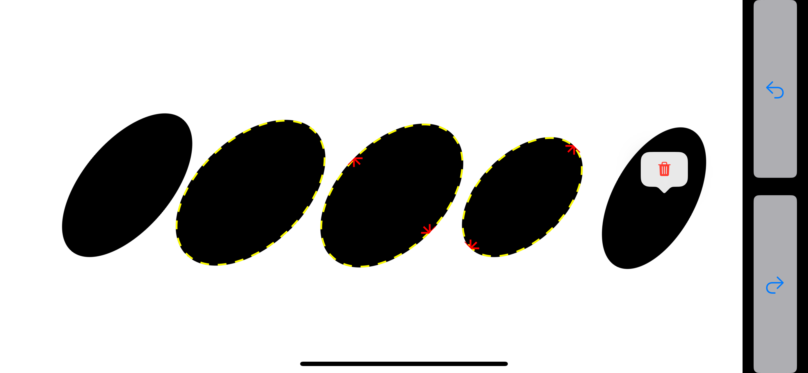
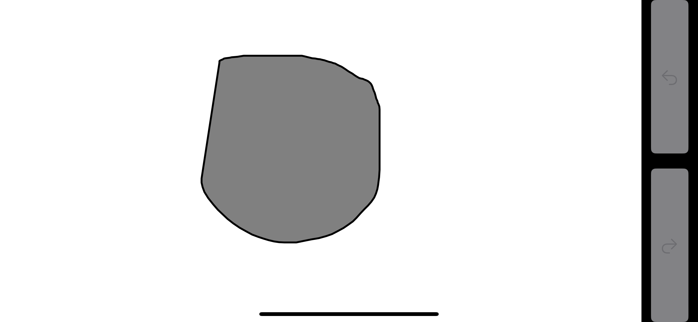
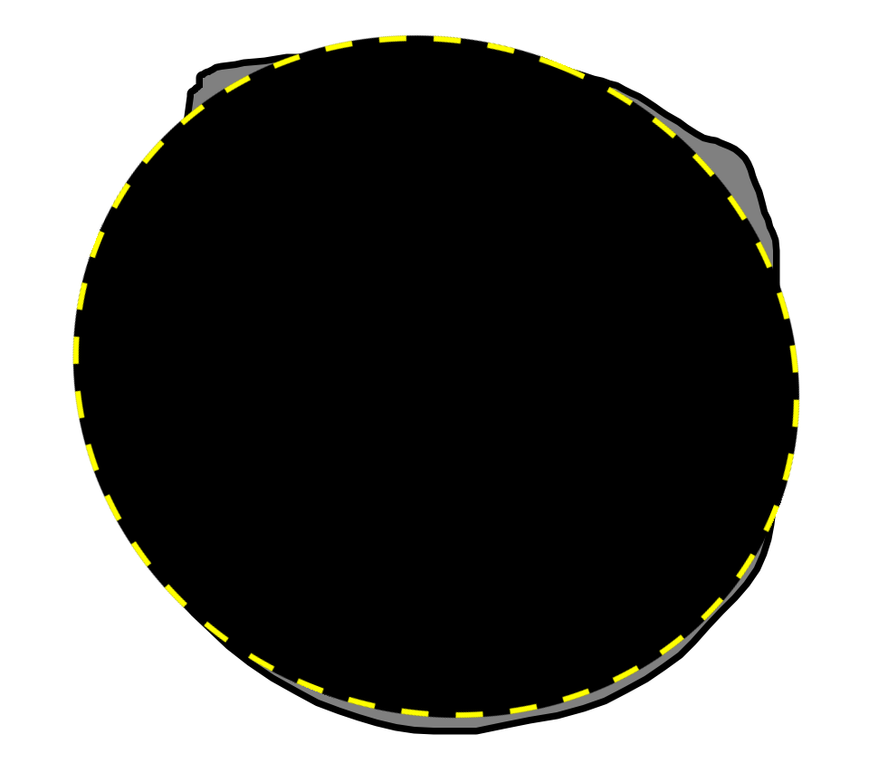
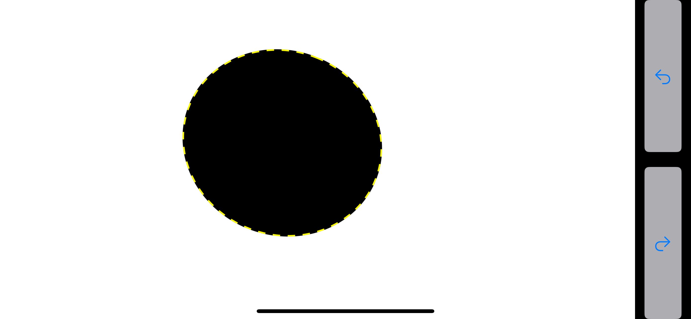
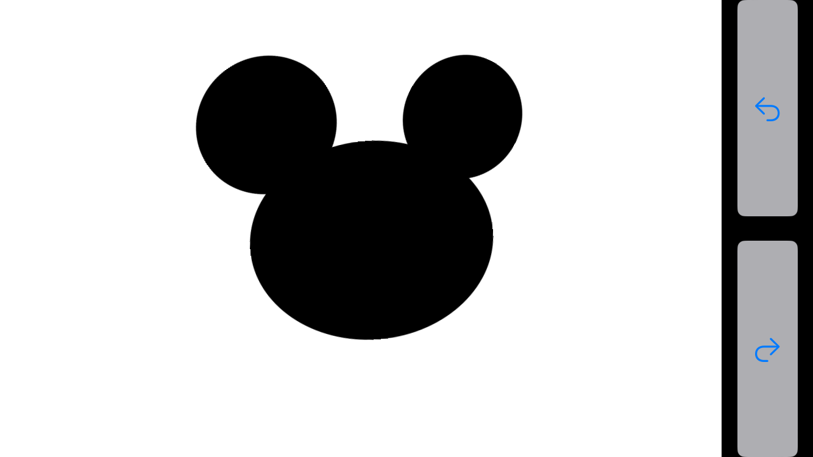
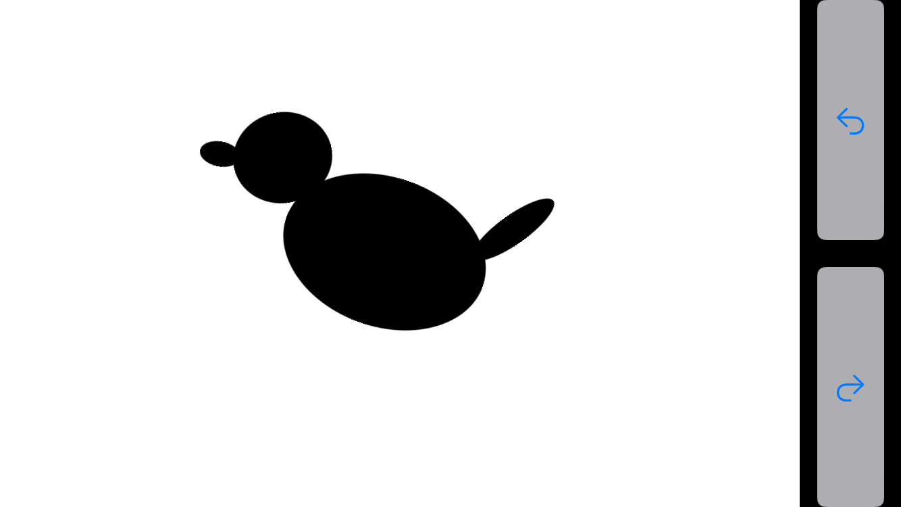

# DrawEllipses: プリミティブベースの形状モデリングインタフェース
ユーザーインターフェイス期末レポート
## 機能
- 楕円の手書きスケッチによる入力
- 指でのドラッグによる楕円の移動
- 指での楕円のサイズの調整（全体のサイズ, 長軸の長さ, 短軸の長さ）
- 指での楕円の回転
- 長押しによる楕円の削除
- Undo/Redo
  
## UIデザイン

### メイン画面
- iPhoneのLandScapeモードで一番右側にUndo/Redoボタンがそれぞれ上下に配置されている
- その左側には描画領域があり、楕円の手書きスケッチによる入力が行われる.

    
### 描画領域
- 手書きスケッチをした後0.4秒程度で手をとめるままにすると, 手書きの軌跡に一番近い楕円が描画される.楕円は同時には一つしか描画されない.

- 描画された楕円は編集モードに入り、指でのドラッグによる移動、サイズの調整、回転が可能である。同一の楕円に対して複数の操作ができないが、複数の楕円をそれぞれ操作することは可能である。
    - 最初に一度タップすると楕円の周りに黄色い点線が現れてドラッグ可能になり、サイズが調整可能になる
        - 複数の楕円を同時に編集モードにすることが可能である.
    - もう1回か2回タップすると楕円は長軸か短軸の長さが調整可能になる.
        - どの軸かを指示するための赤色の矢印が現れる。
    - 編集モードをオフにするには黄色い点線が消えるまで楕円をタップし続けるか, 描画区域の空白の部分をタップするという２つの方法がある。
    - 楕円に長押しすると「Delete」ボタンが現れる。
- Undo/Redoは楕円の移動、回転、サイズ変更、削除、追加に対応する.

### 操作動画

      
## ユーザーテスト
- ユーザー1

    - 説明なしでsample0.pngおよびsample1.pngのモデリングに成功
    
    
    - 自力で発見できなかった点
        - 長押しによる楕円の削除
        - 2本の指で楕円を回転させること
        - 楕円は長軸と短軸の長さがぞれぞれ調整できること
    - 使いやかった点
    - 使いにくかった点
        - ユーザー1にテストしてもらった時点で楕円の位置とサイズの調整はスケッチとは分離されていないため、楕円の中からスケッチしようとすると楕円が移動してしまうことがある。

ユーザー1の意見を受けて, 画面上のすでにある図形の中から描画し始める傾向が見られるので, UIを再デザインした。主な点は
- 楕円の編集モードに入るには一度その楕円をタップする必要がある
- 楕円が編集モードにある時は楕円の辺に黄色の点線が表示されるようにした
- 手書きスケッチを優先的に認識するようにした

再度ユーザー1にテストしてもらったところ, 使いやすくなったとの意見をもらった。
