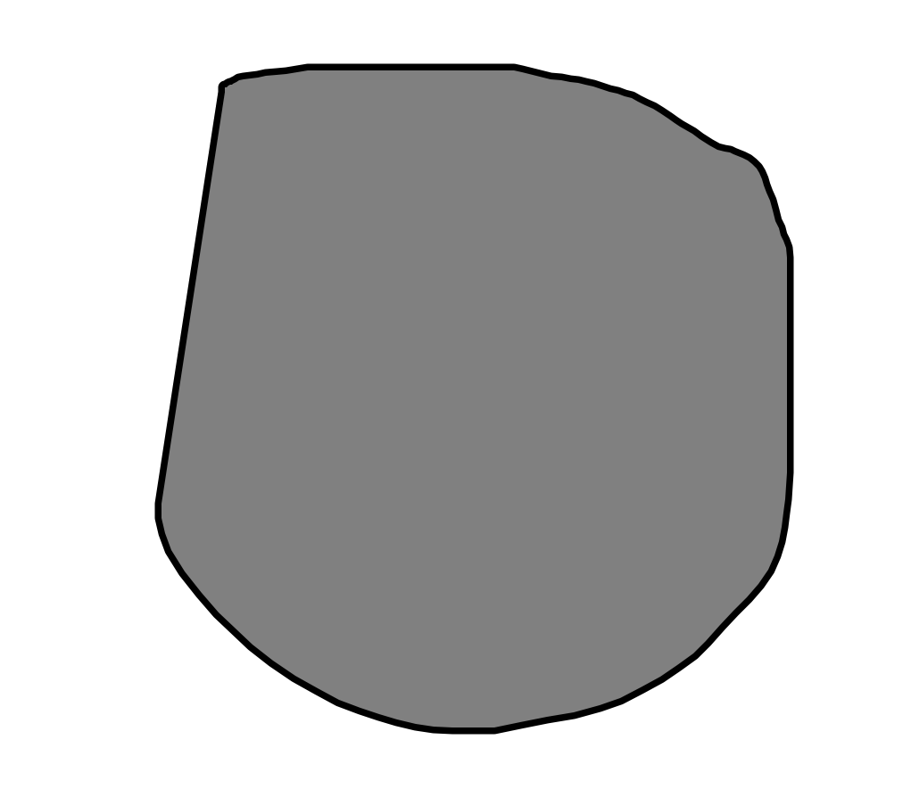
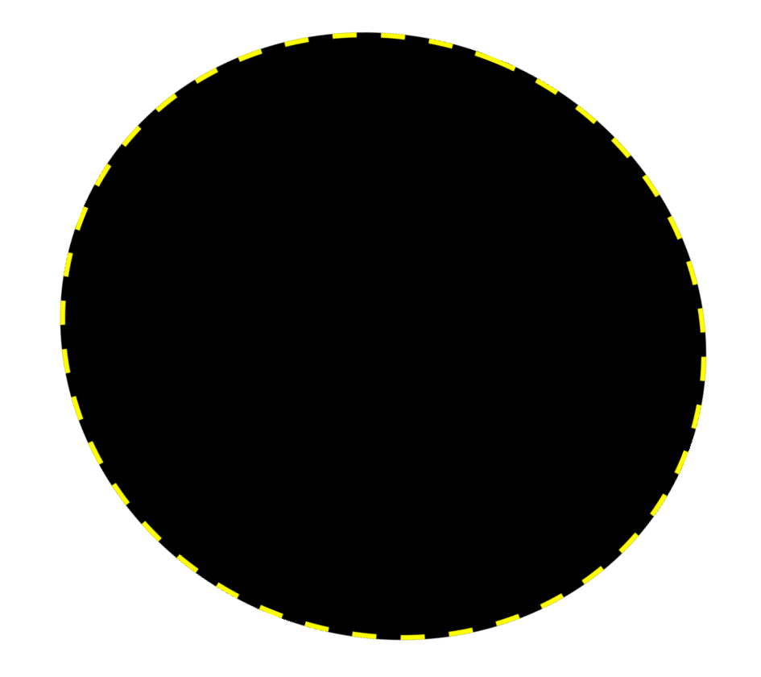

# DrawEllipse: プリミティブベースの形状モデリングインタフェース
ユーザーインターフェイス期末レポート
## 機能 (1.0版)
- 楕円の手書きスケッチによる入力
- 指でのドラッグによる楕円の移動
- 指での楕円のサイズの調整
- 指での楕円の回転
- 長押しによる楕円の削除
- Undo/Redo

## UIデザイン

- メイン画面
    - iPhoneのLandScapeモードで一番右側にUndo/Redoボタンがそれぞれ上下に配置されている
    - その左側には描画領域があり、楕円の手書きスケッチによる入力が行われる

    
- 描画領域
    - 手書きスケッチをした後0.4秒程度で手をとめるままにすると, 手書きの軌跡に一番近い楕円が描画される.楕円は同時には一つしか描画されない.
    
    
    
    - 描画された楕円は編集モードにあり、指でのドラッグによる移動、サイズの調整、回転が可能である。同一の楕円に対して複数の操作ができないが、複数の楕円をそれぞれ操作することは可能である。
    
    

## ユーザーテスト
- ユーザー1

    - 説明なしでsample0.pngおよびsample1.pngのモデリングに成功
    
    
    - 自力で発見できなかった点
        - 長押しによる楕円の削除
        - 2本の指で楕円を回転させること
        - 楕円は長軸と短軸の長さがぞれぞれ調整できること
    - 使いやかった点
    - 使いにくかった点
        - ユーザー1にテストしてもらった時点で楕円の位置とサイズの調整はスケッチとは分離されていないため、楕円の中からスケッチしようとすると楕円が移動してしまうことがある。

ユーザー1の意見を受けて, 画面上のすでにある図形の中から描画し始める傾向が見られるので, UIを再デザインした。主な点は
- 楕円の編集モードに入るには一度その楕円をタップする必要がある
- 楕円が編集モードにある時は楕円の辺に黄色の点線が表示されるようにした
- 手書きスケッチを優先的に認識するようにした

再度ユーザー1にテストしてもらったところ, 使いやすくなったとの意見をもらった。
